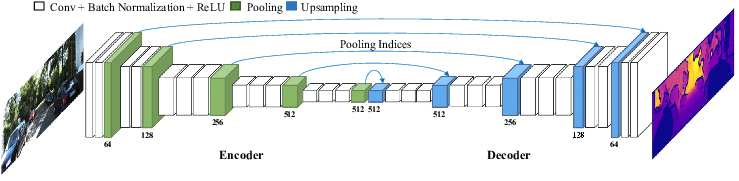
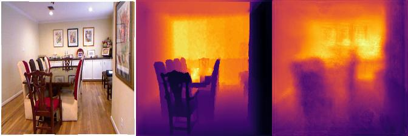
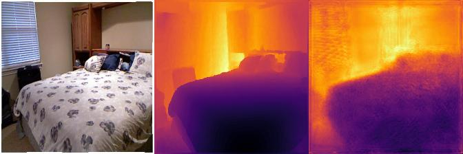
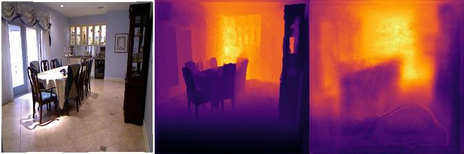
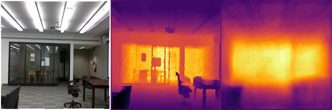
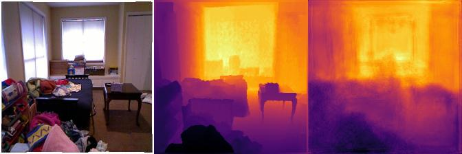
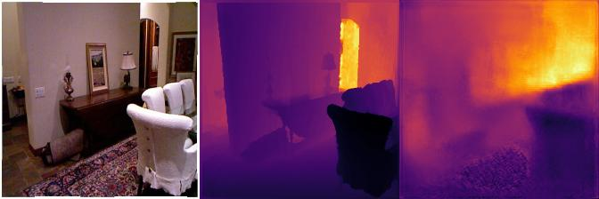
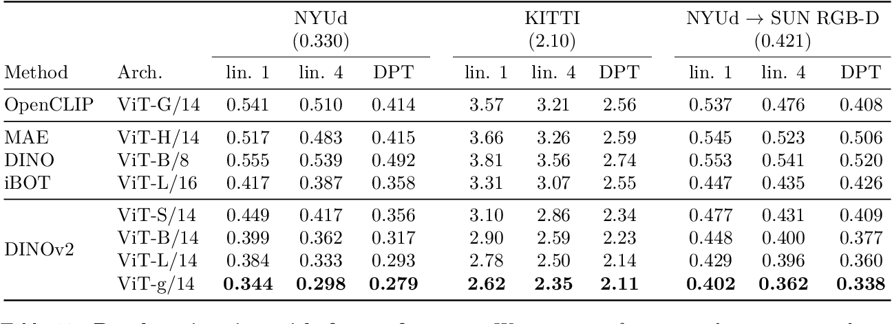

# Depth estimation project
## General description
In this repository 3 solutions for estimating the depth of pixels in images are implemented using the labeled [nyu_depth_v2](https://www.kaggle.com/datasets/soumikrakshit/nyu-depth-v2) dataset. Download the dataset and move the `data` folder into the repository. The 1st solution is the training-evaluation of UNet architecture using PyTorch. The 2nd solution is a regression model using scikit learn. In this solution we are choosing the best model after cross-validation and grid-search. The 3rd solution is a ready-to-use pre-trained Transformer called DinoV2. There is no access to GPU so for the first solution there is no proper experimentation. But the 1st solution contains code for running into GPU. For the 2nd sklearn solution the experiments were done on a small subset to evaluate end-to-end running capability. The whole project was done in almost 8 hours (2 mornings) and the final commits are some micro-fixes.
## Installation
Create and activate python virtual environment:
```commandline
virtualenv -p python3 venv
source venv/bin/activate
```
If your native python-version is not 3.9, you can install pyenv with the python version
you need and then:
```commandline
pyenv virtualenv 3.9.4 venv
pyenv local venv
```

Then install all the packages:
```commandline
pip install -e .
```
After pip install, all the packages are installed for all the 3 solutions.
## Dataset and pre-processing
The [data_view](https://github.com/chrisrn/depth_estimation/blob/master/src/data_view.ipynb) notebook is used to get a first idea of the data we have. The pre-processing in the 1st pytorch solution contains standard processing transforms of horizontal flips, random brightness, random resize etc. and finally a resize of `224x224` and normalization using imagenet mean-std values. The validation-test sets transforms contain only the final resize and normalization. The pre-processing applied on the 2nd solution is the resize to `224x224` and imagenet normalization on both training-test data.
## How to run the UNet pipeline
There is only one script to run inside the `src` folder:
```bash
python main.py
```
which takes a default one argument, the [config.json](https://github.com/chrisrn/depth_estimation/blob/master/src/config.json) file. This file contains `hyper_parameters` to set up different experiments, `data` for data directory and num workers (we can use 8 if we are on GPU), `callbacks` to activate different learning rate plans and `model` for finetuning a model. The `epoch_begin` flag in `callbacks` is the starting epoch for activating them. The learning rate plan followed is the one-cycle for faster training of the network and a finer understanding of the optimal learning rate. In the case of one-cycle plan, the starting lr is the `learning_rate` flag inside the `hyper_parameters` field and the maximum lr of the cycle is 25*starting lr. After running, a folder named `results` contains the results with the timestamp of the experiments and we can view them on tensorboard.
The U-Net architecture is designed to capture both local and global features effectively. U-Net is originally designed for semantic segmentation tasks, where it excels at capturing fine-grained details and boundaries in images. This capability is beneficial for depth estimation, as it allows the network to differentiate between objects and understand the spatial relationships within the scene. In this solution the [segmentation_models_pytorch](https://segmentation-modelspytorch.readthedocs.io/en/latest/) library used form pytorch which provides unets with different encoders-decoders and we can view them in the encoders section with the number of parameters. In the [UNet](https://github.com/chrisrn/depth_estimation/blob/master/src/UNet.py) script we use the default value of resnet18 with almost 16M parameters but for the experiments on CPU we used the lightest model which is a UNet based on mobilent v2 with 6.8M parameters.
.

In our implementation the input dimensions after pre-processing are `224x224x3` and the output mask `224x224x1`
### Results of UNet
Below we can see some result depth maps (image/target/prediction) after training a UNet with mobilenet v2 encoder-decoder. After a long training of only 3 epochs on CPU the model achieved an SSIM=0.88. If we use a deeper encoder-decoder model (like resnet 18) and train for more epochs on GPU the results will be promising.

<p float="left">
  
   
  
</p>
<p float="left">
  
   
  
</p>

## How to run the sklearn regression pipeline
In this solution we demonstrate the process of choosing the best model after cross-validation and grid-search on a small subset of data. If we had more memory to run it faster, then of course we would try more regression models using a bigger subset or all the data if possible. In this case we are choosing only 3 models, Random Forest, Gradient Boosting and KNN regressors. The results are not reliable because we use small models and a small subset. We just implement the process of choosing the best model in [sklearn_best_model](https://github.com/chrisrn/depth_estimation/blob/master/src/sklearn_best_model.ipynb) which can be scaled to more and bigger models and also more data.
There is also a seperate script which runs the best model after running the notebook and it also contains the functions for the data processing.
```bash
python main_sklearn.py
```
This script takes 2 arguments, `data_dir` for the data directory (default `../data`) and `slice` which is the number of samples to use to fit into RAM (default 1000, if we use more data the SSIM score increases but the regression runs slower). The idea behind this solution is that we use as input a 2-d array of dimensions `(num_images x image_dims, 3)` where the number of features are the 3 RGB values (after image processing). We use as labels a 1-d array of dimensions `(num_masks x mask_dims)` which are the depths to predict. The processing before training is more simple than the pytorch implementation (resize to `224x224` and normalization using imagenet mean and std). Random forests can handle non-linearity well, they are robust to overfitting, and they can capture complex interactions in the data, but they are computationally demanding.

## Evaluation
The metrics used for evaluation are the mean squared error (MSE) and the structural similarity index (SSIM). The SSIM is a perceptual metric that takes into account the structural similarity of the two images. SSIM is calculated by comparing the local patterns of the two images, taking into account the luminance, contrast, and structure of the images. SSIM is more robust to noise and small changes than MSE, but it is also more computationally expensive to calculate. In general, SSIM is preferred over MSE for image quality assessment because it provides a more accurate measure of how humans perceive the similarity of two images. However, MSE is still a useful metric, especially when speed is important.


## Ready-to-use approaches
3 state-of-the-art approaches that can be used without training and give great results on  NYU v2  and KITTI datasets are:
### [DinoV2](https://github.com/facebookresearch/dinov2) 14 Apr 2023 
A self-supervised model from facebook research. The RMSE is 0.279 on NYU v2 dataset. DINOv2 has a Vision Transformer (ViT) head that you can use to compute embeddings out of the box for image-to-image retrieval and classification tasks. The pre-trained DINOv2 weights range from 84.2 MB for the smallest model to 4.2 GB for the largest model. This is also a solution which can be used by running the [dinov2](https://github.com/chrisrn/depth_estimation/blob/master/src/dinov2.ipynb) notebook which loads the pre-trained model from [Hugging Face](https://huggingface.co/facebook/dpt-dinov2-base-nyu) and you can see how to run it inside the notebook. The reason of choosing this method is because it is an easy-to-run model from the transformers library and it gives great predictions using only the image content in some lines of code. It is also the best model available on hugging face pre-trained on nyu v2 dataset.

The RMSE is reported on different architectures when training a linear classifier on top of 1 or 4 transformer layers:

### [EVP](https://github.com/lavreniuk/evp) (Enhanced Visual Perception) 13 Dec 2023 
which exploits also text content for the depth estimation. The RMSE is 0.224 on NYU v2 dataset. An Inverse Multi-Attentive Feature Refinement (IMAFR) module is developed which enhances feature learning capabilities by aggregating spatial information from higher pyramid levels. 


Second, a novel image-text alignment module is developed for improved feature extraction of the Stable Diffusion backbone. The resulting architecture is suitable for a wide variety of tasks and it can achieve high performance in the context of single-image depth estimation with a specialized decoder using classification-based bins and referring segmentation with an off-the-shelf decoder. Comprehensive experiments conducted on established datasets show that EVP achieves state-of-the-art results in single-image depth estimation for indoor (NYU Depth v2, 11.8% RMSE improvement over VPD) and outdoor (KITTI) environments. You can also try a [demo](https://huggingface.co/spaces/MykolaL/evp) on Hugging Face.

The results comparing to other methods on NYU v2 dataset:

### [Depth Anything](https://github.com/LiheYoung/Depth-Anything?tab=readme-ov-file) 19 Jan 2024
Which is a zero-shot depth estimation method and utilized both labeled and unlabeled images for training. Distinguished from prior works that laboriously construct diverse labeled datasets, the value of unlabeled images is highlighted in enhancing the data coverage.
Solid line: flow of labeled images, dotted line: unlabeled images. The value of large-scale unlabeled images is epecially highlighted. The S denotes adding strong perturbations. To equip the depth estimation model with rich semantic priors, an auxiliary constraint is enforced between the online student model and a frozen encoder to preserve the semantic capability

You can also try a [demo](https://huggingface.co/spaces/LiheYoung/Depth-Anything) on Hugging Face.
We can see that the RMSE on NYUv2 dataset is the lowest comparing to EVP and Dino:
